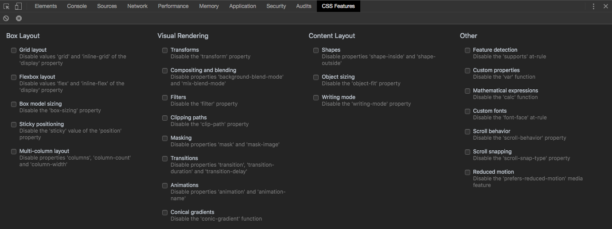

# CSS Feature Toggle Extension

This devtools extension provides the ability to toggle-off CSS features, allowing developers to see how their pages and applications render and fallback in browsers that don't support modern CSS features.

Available for Chrome via the [Chrome Web Store](https://chrome.google.com/webstore/detail/css-feature-toggles/aeinmfddnniiloadoappmdnffcbffnjg).

## Supported browsers

* Chrome — installable via [Chrome Web Store](https://chrome.google.com/webstore/detail/css-feature-toggles/aeinmfddnniiloadoappmdnffcbffnjg)
* Opera

This extension uses devtools API features that aren't supported in Firefox yet:

  * `devtools.inspectedWindow.getResources()`
  * `devtools.inspectedWindow.onResourceAdded`
  * `resource.getContent()`
  * `resource.setContent()`

## Limitations

Toggling CSS features isn't supported everywhere *yet* so you should be aware of these caveats:

* Inline styles (`
`) will not be disabled.
* Changes made to a stylesheet via the CSSOM will not be disabled.

---

# Contributing

## Installing for development

1. Clone this repo.
2. Start Chrome, open the **Extensions** manager and enable **Developer Mode**.
3. Click **Load unpacked extension** and select the repo folder (the one containing `manifest.json`)
4. Open devtools and click the **CSS Features** tab to use the extension.

## Making code changes

1. Update code
2. Close/re-open devtools to see your changes

## Testing

In the `/tests/browser` directory you'll find a test page which can be opened in a supported browser. The page contains one or more tests for each toggle. If you make changes and want to submit a pull request, please ensure the tests behave first. If you're adding a new toggle, please try to update the page with relevant tests or ask for assistance in your pull request.

---

## How it works

The extension uses `browser.devtools.inpectedWindow.getResources()` to fetch the content of stylesheet and document resources loaded in the current window. For stylesheet resources, `resource.getContent()` is used to extract the style content. For document resources, a script is injected into the document which extracts the CSS content from `<style>` elements.

Extracted style content is passed through a series of regular expressions that rename the feature property/value/identifiers. The original content is then replaced with the modified CSS using either `resource.setContent`, for stylesheets or - for document styles - by injecteding a script to update the relevant `<style>` elements. For example:

* `display: flex` becomes `display: -disabled-flex`
* `@supports (...) {}` becomes `@-disabled-supports (...) {}`
* `transform: ...` becomes `@-disabled-transform: ... {}`
* `width: calc(...)` becomes `width: -disabled-calc(...)`
